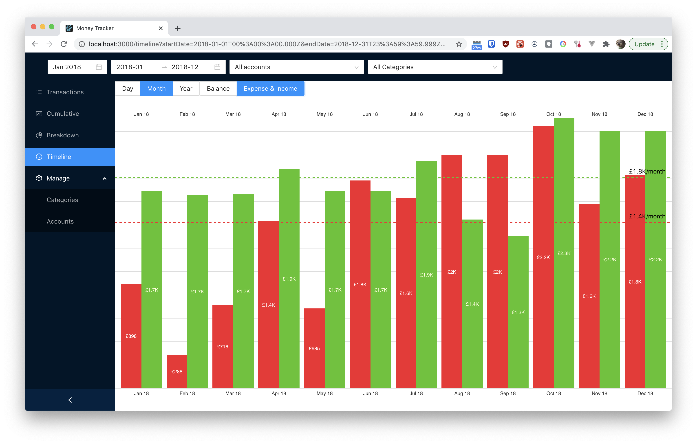

# Money tracker

Visualise your personal finances.



## Prerequisites

- Docker
- Docker compose
- Node.js

## Quick start

Make Docker is running. Then:

```sh
$ npm run api:up
$ npm start
```

To update the database:

```sh
$ cd hasura
$ hasura console
```

Migrate an existing Homebank xhb file:

```sh
$ npm run bootstrap:xml-to-json
$ npm run bootstrap:json-to-postgres
```

TODO:

- key monzo transactions by tx\_ id so that we dont get duplicates
- add description column into final description for split bills and missing notes

## Learn More

You can learn more in the [Create React App documentation](https://facebook.github.io/create-react-app/docs/getting-started).

To learn React, check out the [React documentation](https://reactjs.org/).

### Code Splitting

This section has moved here: https://facebook.github.io/create-react-app/docs/code-splitting

### Analyzing the Bundle Size

This section has moved here: https://facebook.github.io/create-react-app/docs/analyzing-the-bundle-size

### Making a Progressive Web App

This section has moved here: https://facebook.github.io/create-react-app/docs/making-a-progressive-web-app

### Advanced Configuration

This section has moved here: https://facebook.github.io/create-react-app/docs/advanced-configuration

### Deployment

This section has moved here: https://facebook.github.io/create-react-app/docs/deployment

### `npm run build` fails to minify

This section has moved here: https://facebook.github.io/create-react-app/docs/troubleshooting#npm-run-build-fails-to-minify
